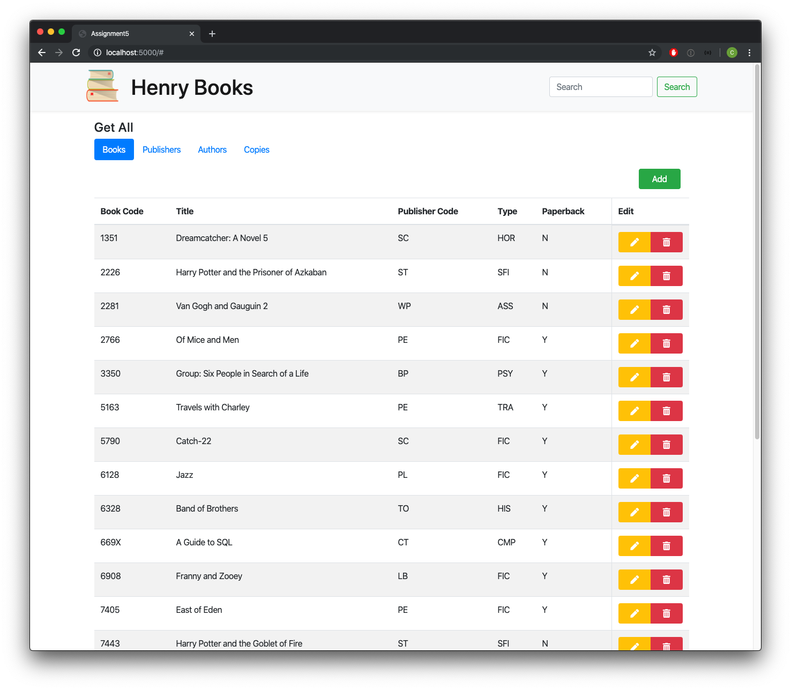
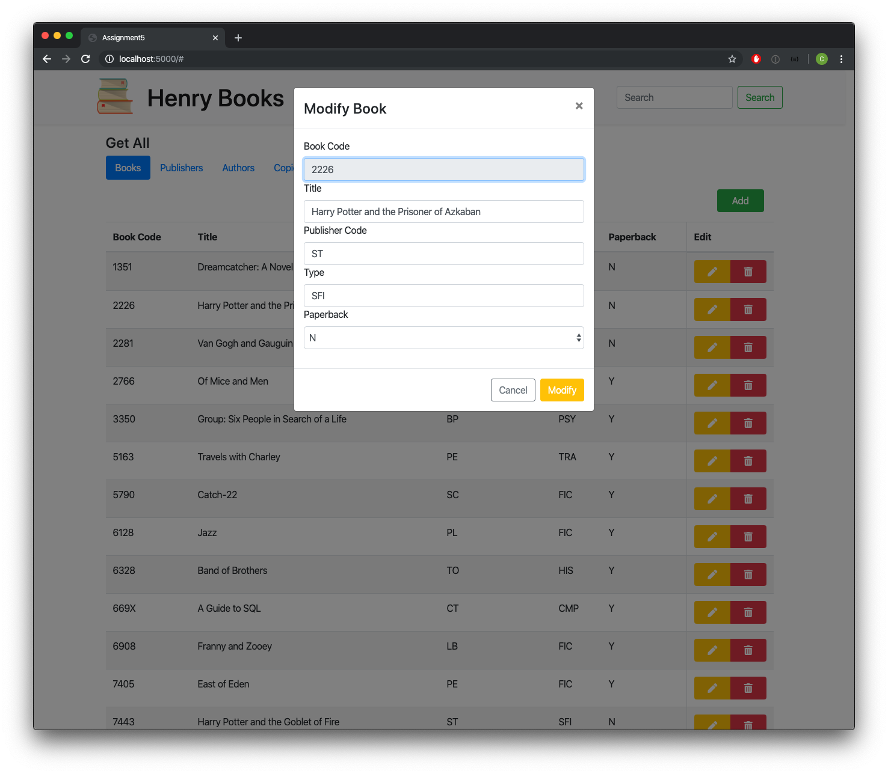
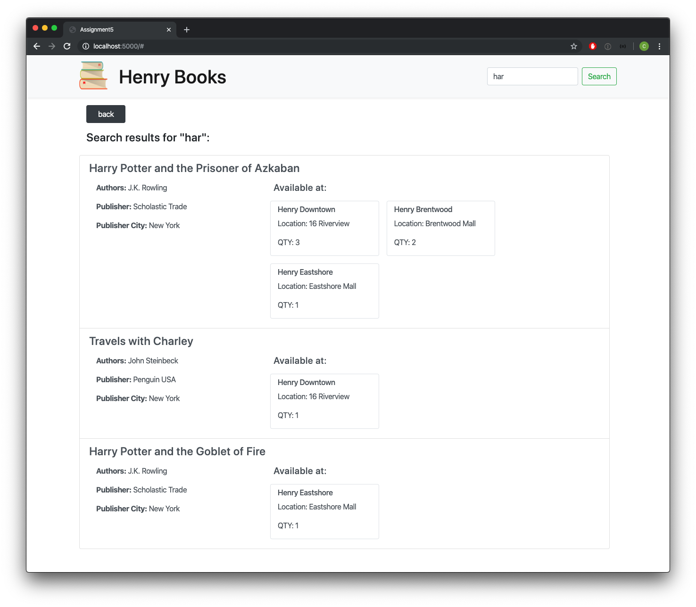

# COP4710-Assignment5
A website using Angular, Node, Express, and MySql to update, modify, and retrieve data from database.

**usage:** Install npm and Angular CLI

*change api.config.ts to your computers local network*

Run `$npm i` and `$ng serve` and got to localhost:4200

# Screenshots

 

 

